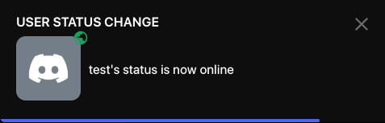

# NotifyUserChanges

Adds a notify option in the user context menu to get notified when a user changes voice channels, online status, or game activity

This is a reimplimentation of [BetterDiscord's FriendNotifications](https://github.com/mwittrien/BetterDiscordAddons/tree/c561c50fadf8ce7e7862e6a090e48196f6069b9b/Plugins/FriendNotifications) plugin and a fork of [NotifyUserStatus](https://github.com/D3SOX/Vencord/tree/plugin/notifyUserChanges) with updated compatibility for latest Vencord versions and userplugins folder support.

## Installation

You probably already know this, but just in case:

1. Make sure you have [Vencord](https://github.com/Vendicated/Vencord) repository cloned and have the userplugins folder created in root/src directory.
2. Clone this repository to your userplugins folder.
3. run `pnpm install`, `pnpm build` and `pnpm inject` in the root of the Vencord repository.
